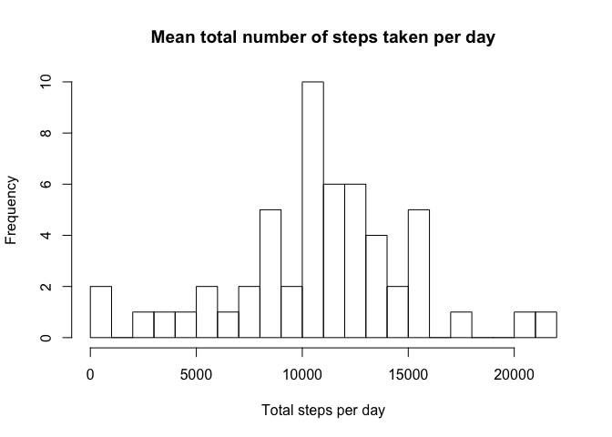
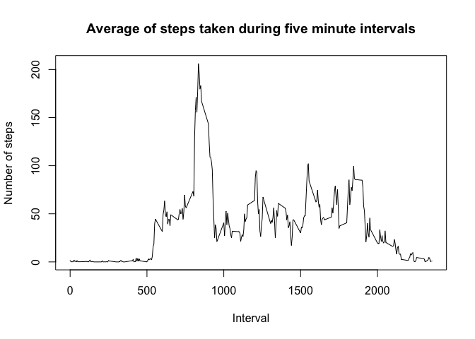
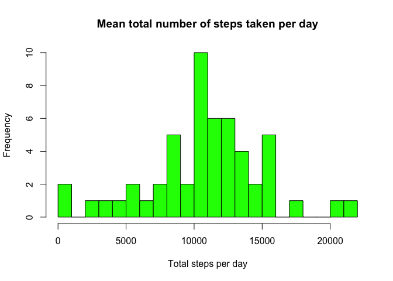
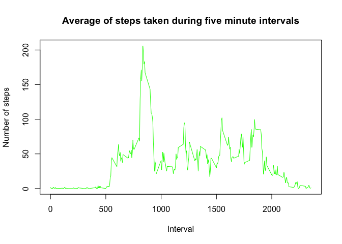
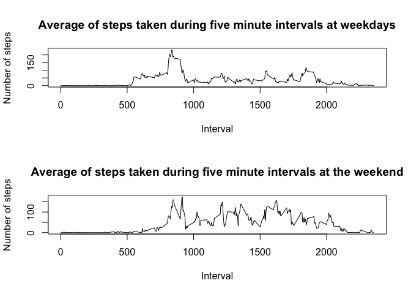

## Loading and preprocessing the data

The data should be loaded and preprocessed to transform it into a suitable format for the analysis.

```r
unzip("./activity.zip")
data<-read.csv("./activity.csv")
head(data)
```

```
##   steps       date interval
## 1    NA 2012-10-01        0
## 2    NA 2012-10-01        5
## 3    NA 2012-10-01       10
## 4    NA 2012-10-01       15
## 5    NA 2012-10-01       20
## 6    NA 2012-10-01       25
```

```r
data$date <- as.Date(data$date, "%Y-%m-%d")
str(data)
```

```
## 'data.frame':	17568 obs. of  3 variables:
##  $ steps   : int  NA NA NA NA NA NA NA NA NA NA ...
##  $ date    : Date, format: "2012-10-01" "2012-10-01" ...
##  $ interval: int  0 5 10 15 20 25 30 35 40 45 ...
```


## What is mean total number of steps taken per day?

Firstly, a histogram of the total number of steps taken by day.

```r
data_by_date<-aggregate(steps ~ date, data, sum)
hist(data_by_date$steps, main="Mean total number of steps taken per day", xlab="Total steps per day", breaks = 30)
```

<!-- -->

Now, the mean and median number of steps taken each day are calculated.

```r
mean(data_by_date$steps)
```

```
## [1] 10766.19
```

```r
median(data_by_date$steps)
```

```
## [1] 10765
```

## What is the average daily activity pattern?

A new data frame with the average of steps for each five minute interval is created. Then, the average daily activity pattern can be plotted.

```r
data_by_interval<-aggregate(steps ~ interval, data, mean)
plot(data_by_interval$interval, data_by_interval$steps, type="l", xlab ="Interval", ylab = "Number of steps", main="Average of steps taken during five minute intervals")
```

<!-- -->

The 5-minute interval that, on average, contains the maximum number of steps is the following one:

```r
data_by_interval$interval[which.max(data_by_interval$steps)]
```

```
## [1] 835
```

## Imputing missing values

The presence of missing values could introduce bias into some calculations or summaries of the data. In the following code lines, we will get rid of those NA values in order to plot clean data.

```r
no_na<-complete.cases(data)
new_data<-data[no_na,]
new_data_by_date<-aggregate(steps ~ date, new_data, sum)
new_data_by_interval<-aggregate(steps ~ interval, new_data, mean)
hist(data_by_date$steps, main="Mean total number of steps taken per day", xlab="Total steps per day", breaks = 30, col = "green")
```

<!-- -->

```r
plot(new_data_by_interval$interval, data_by_interval$steps, type="l", xlab ="Interval", ylab = "Number of steps", main="Average of steps taken during five minute intervals", col="green")
```

<!-- -->


## Are there differences in activity patterns between weekdays and weekends?

Two new data frames will be created from the main one in order to separate the data depending on the weekday.

```r
library(timeDate)
library(dplyr)
```

```
## 
## Attaching package: 'dplyr'
```

```
## The following objects are masked from 'package:stats':
## 
##     filter, lag
```

```
## The following objects are masked from 'package:base':
## 
##     intersect, setdiff, setequal, union
```

```r
day_data<-new_data %>% select(steps, date, interval) %>% mutate(weekday=weekdays(date))
weekday_data<-subset(day_data, weekday%in%c("lunes", "martes", "miércoles", "jueves", "viernes"))
weekday_data_by_interval<-aggregate(steps ~ interval, weekday_data, mean)
weekend_data<-subset(day_data, weekday%in%c("sábado", "domingo"))
weekend_data_by_interval<-aggregate(steps ~ interval, weekend_data, mean)
```

Now, the activity patterns at weekdays and weekends can be plotted

```r
par(mfrow=c(2, 1))
plot(weekday_data_by_interval$interval, weekday_data_by_interval$steps, type="l", xlab ="Interval", ylab = "Number of steps", main="Average of steps taken during five minute intervals at weekdays")
plot(weekend_data_by_interval$interval, weekend_data_by_interval$steps, type="l", xlab ="Interval", ylab = "Number of steps", main="Average of steps taken during five minute intervals at the weekend")
```

<!-- -->
